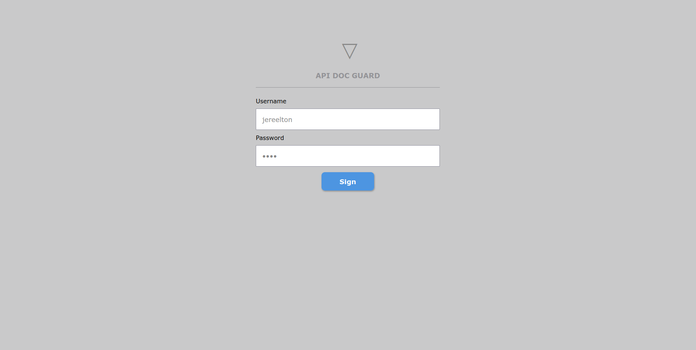
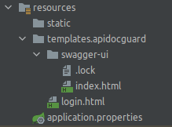
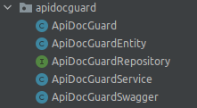

# API DOC GUARD
A simple project to API document protect

When API DOC GUARD is installed in the application it catches the requests into endpoints refers to currently manager 
documentation, as example in the Swagger, when is requested to http://localhost:31303/swagger-ui/index.html this request 
is intercepted and is required a login by username and password.
 
This can be look in ApiDocGuardSwagger that is placed in the apidocguard package (path) 
in the current application, is very simple just make the correct settings explained below.

# Resources

* Java 8 (jdk-1.8-212)
* Maven Project
* Spring Boot 2.0.1.RELEASE

# Dependencies

* Lombok
* Spring Data JPA
* Mysql Driver
* Log4j2
* Spring Rest Docs
* Spring Web
* Rest Repositories
* Rest Template (Client)
* Swagger (OpenAPI 3)
* Thymeleaf
* Crypto/MD5

# Environment Details
<pre>
- Linux Ubuntu 20.04 LTS

JDK
$ javac -version
javac 1.8.0_212

JRE
$ java -version
java version "1.8.0_212"
Java(TM) SE Runtime Environment (build 1.8.0_212-b10)
Java HotSpot(TM) 64-Bit Server VM (build 25.212-b10, mixed mode)
</pre>

<pre>
- Windows 10 PRO

################
# JAVA 8 (1.8)
################

INSTALLERS
jdk-8u212-windows-x64.exe
jre1.8.0_212-windows-x64.exe (automatic download by jdk)

JDK
$ javac -version
javac 1.8.0_212

JRE
$ java -version
java version "1.8.0_212"
Java(TM) SE Runtime Environment (build 1.8.0_212-b10)
Java HotSpot(TM) 64-Bit Server VM (build 25.212-b10, mixed mode)

--------------------------------------------------------------------------------------------------

</pre>

---------------------------------------------------------------------------------------------------

# Maven Commands (jar generate)

1. mvn package
2. mvn clean compile assembly:single
3. mvn clean
4. mvn clean install
5. mvn clean package spring-boot:repackage

---------------------------------------------------------------------------------------------------

# List of Documentation Managers

* OpenAPI with Swagger

> The openAPI with Swagger-UI is available to query and help understand the application by REST API

* http://localhost:31303/swagger-ui/protector

* OpenAPI with Adobe AEM

> The openAPI with Adobe-AEM is available to query and help understand the application by REST API

* http://localhost:31303/adobe-aem/protector

* OpenAPI with Authentiq API

> The openAPI with Authentiq API is available to query and help understand the application by REST API

* http://localhost:31303/authentiq-api/protector

---------------------------------------------------------------------------------------------------

# OAuth2 Settings

If your application use the OAuth2 as a security layer, can be needed to make any configurations in the scope of the 
project as showed below...

<code>

    @Override
    public void configure(final HttpSecurity http) throws Exception {
       http.authorizeRequests()

               /*APP SERVICES*/
               .antMatchers("/users/delete").authenticated()
               .antMatchers("/users/create").authenticated()

               /*OTHERS SERVICES*/
               .antMatchers("/auditory/view").authenticated()

               /*SWAGGER*/
               .antMatchers("/swagger/**").permitAll()
               .antMatchers("/swagger-ui/**").permitAll()
               .antMatchers("/api-docs/**").permitAll()
               .antMatchers("/api-docs.yaml").permitAll()

               /*API-DOC-GUARD*/
               .antMatchers("/doc-protect/**").permitAll()
               .antMatchers("/api-doc-guard/**").permitAll()
               .antMatchers("/api-docs-guard/**").permitAll()

               /*CUSTOM*/
               .antMatchers(custom_api_prefix+"/swagger/**").permitAll()
               .antMatchers(custom_api_prefix+"/swagger-ui/**").permitAll()
               .antMatchers(custom_api_prefix+"/doc-protect/**").permitAll()
               .antMatchers(custom_api_prefix+"/api-doc-guard/**").permitAll()
               .antMatchers(custom_api_prefix+"/api-docs-guard/**").permitAll()

               /*ACTUATOR*/
               .antMatchers("/actuator/**").permitAll().anyRequest().authenticated();
    
    }

</code>

---------------------------------------------------------------------------------------------------

# How to use

Follow the instructions below to install API DOC GUARD in your application, is very simple.

> Choose branch

- swagger-ui
- adobe-aem
- authentiq-api
- ...

> Get the files from this repository with a clone or download files

<pre>
git clone https://github.com/huntercodexs/apidocguard
</pre>

> Set up the pom.xml with the dependencies below

<code>

    <!--DATABASE-->
    <dependency>
        <groupId>org.springframework.boot</groupId>
        <artifactId>spring-boot-starter-data-jpa</artifactId>
    </dependency>
    <dependency>
        <groupId>mysql</groupId>
        <artifactId>mysql-connector-java</artifactId>
        <scope>runtime</scope>
    </dependency>
    
    <!--DOC-->
    <dependency>
        <groupId>org.springdoc</groupId>
        <artifactId>springdoc-openapi-ui</artifactId>
        <version>1.6.4</version>
    </dependency>
    <dependency><!--NEEDED TO USE IN API DOC GUARD-->
        <groupId>org.springframework.boot</groupId>
        <artifactId>spring-boot-starter-thymeleaf</artifactId>
    </dependency>
    <dependency><!--NEEDED TO USE BCRYPT IN API DOC GUARD-->
        <groupId>org.springframework.security</groupId>
        <artifactId>spring-security-crypto</artifactId>
        <version>5.6.1</version>
    </dependency>

</code>

> Include these parameters in application.properties

<pre>
## SWAGGER
#----------------------------------------------------------------------------------------------------
# See more: https://springdoc.org/properties.html
springdoc.swagger-ui.enabled=true
springdoc.swagger-ui.path=/swagger-ui-test.html
springdoc.swagger-ui.operationsSorter=method

#StandaloneLayout, BaseLayout
springdoc.swagger-ui.layout=StandaloneLayout
#/api-docs, api-docs-guard, /api-docs-custom
springdoc.api-docs.path=/api-docs-guard
#true, false
springdoc.model-and-view-allowed=true

## API GUARD DOC
#----------------------------------------------------------------------------------------------------
#true, false
apidocguard.enable=true
#localhost, 192.168.15.14, app.domain.com
apidocguard.server-name=192.168.15.14
#swagger, adobe, authentiq
apidocguard.type=swagger
#md5, bcrypt
apidocguard.data.crypt.type=md5
#true, false
apidocguard.url.show=true
#Secrect
apidocguard.secret=9ba8c91f-cacf-41d2-be8d-e8d1bc844a96
</pre>

> Check if the src/main/resources/templates path is according the image below

* Get these file from official GitHub account swagger-ui: https://github.com/swagger-api/swagger-ui

> The index.html is a custom file created by index.html from swagger-ui project on GitHub official account. 

<pre>
Use the current file index.html contained in this project, replace the original swagger index.html
</pre>

> Check if the src/main/java/com/domain/project-name/apidocguard path is according the image below, ex: com.huntercodexs.sample.apidocguard

> Check if the package is ok in the header of classes

* ApiDocGuard:

<code>

package com.huntercodexs.sample.apidocguard;

//Imports...

@Controller
@CrossOrigin(origins = "*")
public class ApiDocGuard {
    //Code here
}

</code>

> Check if database settings is ok and if the table api_doc_guard was created

The ApiDocGuardEntity.java is the file that create this table

---------------------------------------------------------------------------------------------------

# Tests
